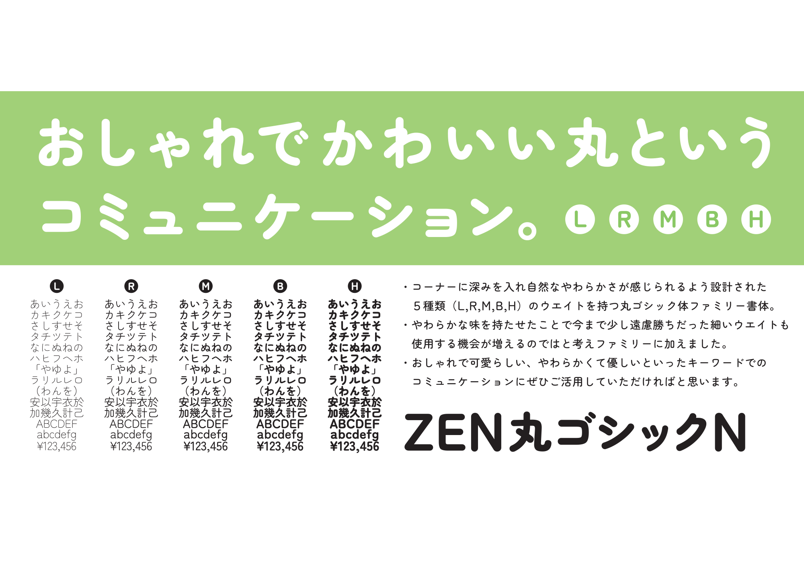

# Zen Fonts Maru Gothic

Zen Maru Gothis is a rounded san serif family that gives a soft and natural impression due to the deep rounds in the corners. Because of this unique soft impression the thin weight is also easy to use in any scenes. Cute and fashionable, soft and easy for any communications.

## The story of Zen Fonts

#### My encounter with typography

A few years after I began my work in typesetting, a certain font caught my interest. It wasn’t beautiful per se, but it had a certain allure that attracted me.  Converting this font to typesetting was a considerable challenge but one which made my work worthwhile and enjoyable. The outline of the characters appeared to be drawn by hand, so the lines were not clean. It was probably designed to be used for vertical writing because when I aligned them horizontally, there was a slight undulation. The thickness and size were inconsistent, giving the font an old-fashioned analog feel. But these very characteristics gave this font an unparalleled uniqueness and flavor that I found to be extremely fascinating.

#### Thoughts on aesthetics of Japanese text

Identifying Japanese text is easier if you imagine them having the following characteristics: kanji is structured and mesh-patterned, hiragana is curvy and soft, katakana is simple and triangular. Japanese text is distinctive in that these different shapes exist together in a sentence. It’s distinct from Latin text in that there is no sense of order or consistency, and it is quite uneven when they’re aligned horizontally. However, there is a certain beauty in the way these irregular shapes together give way to harmony. Kana is used as suffixes following kanji stems to make them easier to read, but perhaps they also serve the purpose of giving “ma (distance/interval),” or blank space that softens the hard edges of kanji placed close together.

#### Designing for readability

When you scale the three geometric shapes □△○, the square appears the largest, followed by the circle and the triangle. This is known to be an optical illusion. For instance, the kanji for mouth “口” appears bigger, so making them smaller is ideal. Other characters require such minor adjustments to its size, thickness, and position in order to correct the illusion. When I make my fonts, I replace kanji with □, hiragana with ○, and katakana with △, then adjust their size and center relative to each other. I make the hiragana smaller compared to kanji, and katakana smaller than the other two, so the font looks well-balanced overall.  

#### Creating the conditions for readability

When I design, I maximize readability using the spacing between characters, lines, length of rows, indention, and the whole page layout. This “ma,” or space, acts as a visual cue to help readers follow the sentence, much like a route map or rest area of an exhibition hall. By setting the characters with this visual aspect in mind, I can create certain conditions for readability while also bringing out the uniqueness of the typeface itself.

#### Traditions and new challenges

My typefaces are simple with a combination of old and new styles. The ZEN Old Mincho R that I released in 1997 uses the traditional old style, which is said to have the most legible font shape. It is a Mincho style typeface that accommodates text or title, horizontal or vertical use. The Zen Kaku Gothic N released in 2009 is a simple Gothic font with scalability. For instance, it doesn’t have the “geta,” the ends of the stroke where the vertical line is longer than the horizontal line. Also, it lacks any ornate serifs. Therefore, this font adapts well to graphic edits and making variations. The Zen Maru Gothic N that I released in 2012 take after the Zen Kaku Gothic N in concept. It’s a maru gothic font, and the corners are intentionally rounded so they appear as though they’ve been weather-worn. In the simplicity of the design you will find scalability and rich expression.

#### Designer

Yoshimichi Ohira

## License

SIL Open Font License ([OFL.txt](OFL.txt))
